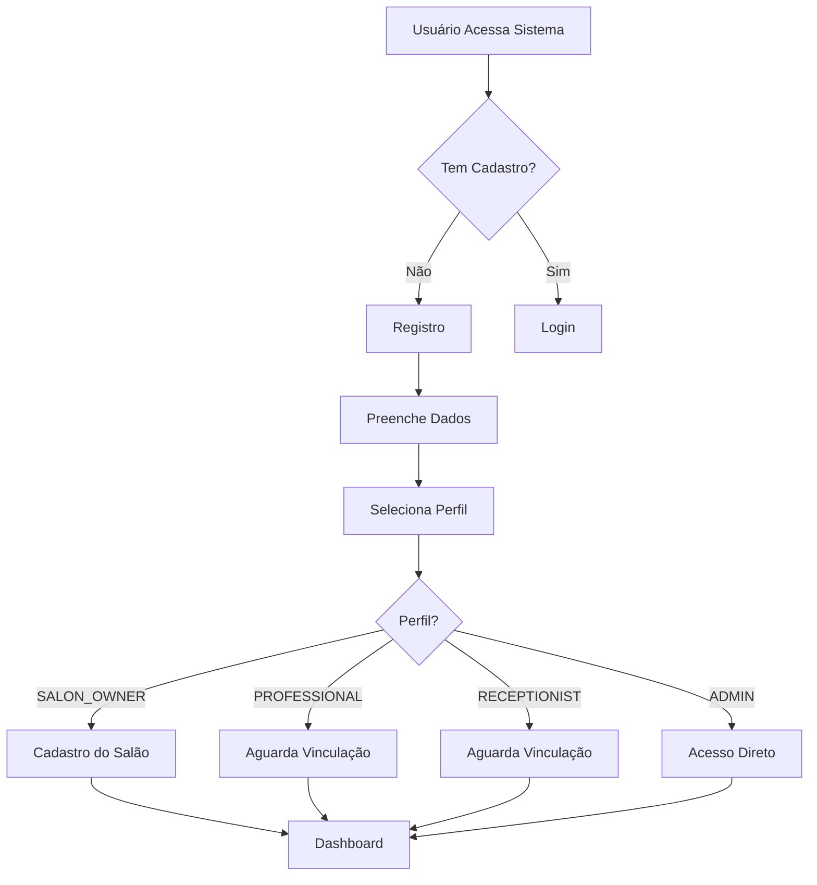
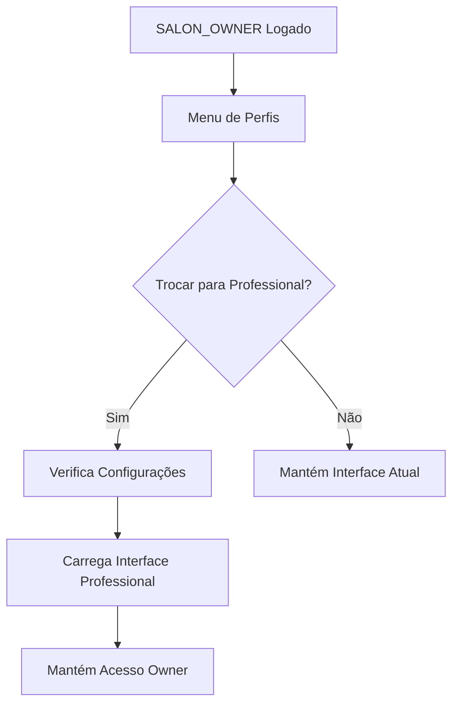
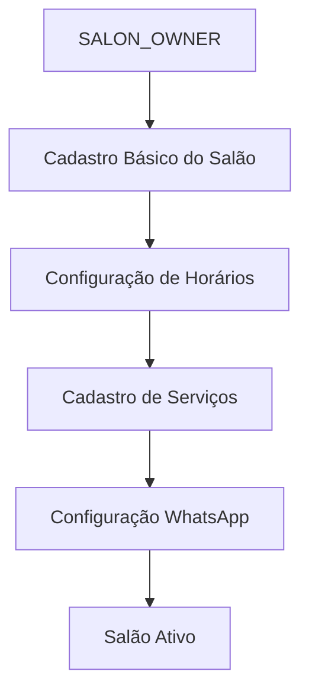
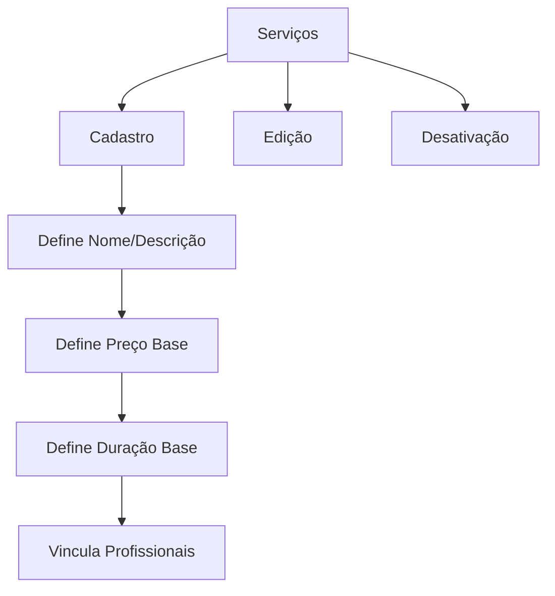
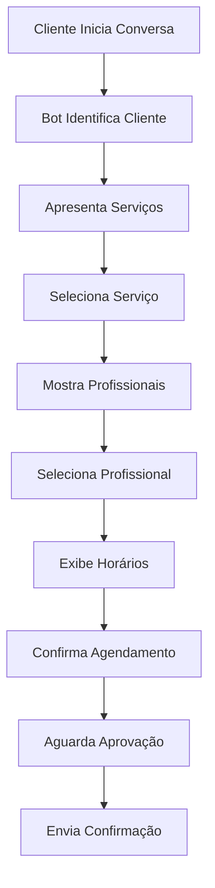
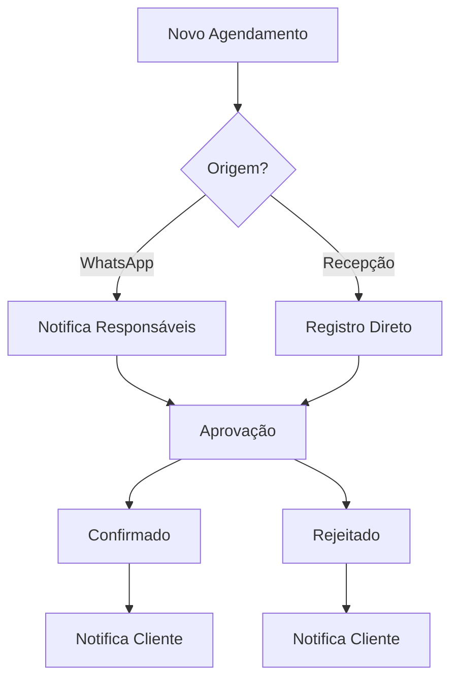
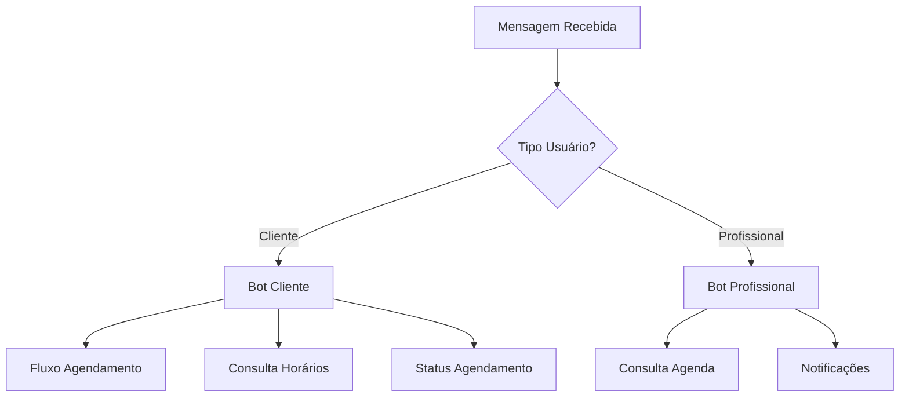
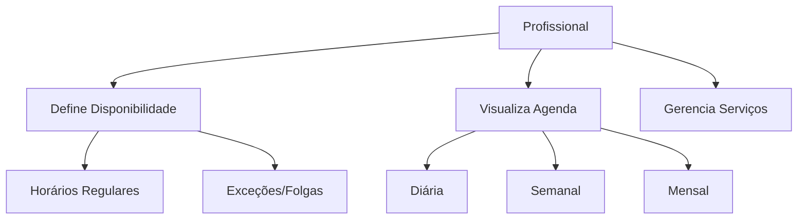
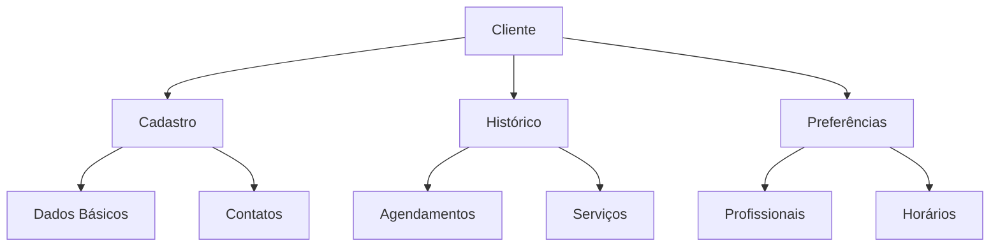

# Fluxos de Usuário e Requisitos de Dados

## 1. Fluxo de Autenticação e Acesso

### 1.1 Registro e Primeiro Acesso

### 1.2 Requisitos de Dados para Autenticação

#### Usuário Base

- ID (único)
- Nome completo
- Email (único)
- Senha (hash)
- Telefone (WhatsApp)
- Status (ativo/inativo)
- Data de criação
- Data de última atualização

#### Perfis Específicos

**SALON_OWNER Adicional**

- Documentos (CPF/CNPJ)
- Dados de faturamento
- Plano de assinatura
- Status do pagamento

**PROFESSIONAL Adicional**

- Especialidades
- Horários de atendimento
- Status de disponibilidade

**RECEPTIONIST Adicional**

- Horário de trabalho
- Permissões específicas

### 1.3 Regras de Negócio

1. **Registro**
   - Email único no sistema
   - Senha com requisitos mínimos de segurança
   - Telefone válido para WhatsApp
   - Verificação de email (opcional na primeira fase)
2. **Login**
   - Bloqueio após tentativas falhas
   - Sessão com duração limitada
   - Refresh token para renovação automática
   - Possibilidade de login via WhatsApp (futura implementação)
3. **Permissões**
   - SALON_OWNER pode atuar como PROFESSIONAL
   - Um usuário pode ter apenas um perfil por salão
   - PROFESSIONAL e RECEPTIONIST precisam ser vinculados a um salão
   - ADMIN tem acesso a todas as funcionalidades

### 1.4 Pontos de Integração
1. **WhatsApp**
   - Validação do número no registro
   - Notificações de acesso
   - Autenticação de dois fatores (futura implementação)
2. **Sistema de Pagamentos**
   - Verificação de assinatura para SALON_OWNER
   - Bloqueio de acesso por inadimplência

### 1.5 Fluxo de Troca de Perfil (SALON_OWNER ↔ PROFESSIONAL)

### 1.6 Tratamento de Erros
1. **Registro**
   - Email já cadastrado
   - Telefone já cadastrado
   - Dados inválidos
   - Falha na integração WhatsApp
2. **Login**
   - Credenciais inválidas
   - Conta bloqueada
   - Sessão expirada
   - Falha na conexão
3. **Vinculação**
   - Salão não encontrado
   - Perfil já existente
   - Permissão negada

### 1.7 Interface com Outros Fluxos
- **→ Gestão de Salão**: Após registro como SALON_OWNER
- **→ Agenda**: Após login como PROFESSIONAL
- **→ Agendamentos**: Após login como RECEPTIONIST
- **→ Administração**: Após login como ADMIN

## 2. Fluxo de Gestão de Salão
### 2.1 Configuração Inicial do Salão

### 2.2 Requisitos de Dados do Salão
- ID (único)
- Nome do salão
- CNPJ
- Endereço completo
- Telefone comercial
- WhatsApp do salão
- Logo/Imagens
- Horários de funcionamento
- Status (ativo/inativo)
- Configurações de notificação
- Data de criação
- Data de última atualização

### 2.3 Gestão de Serviços

## 3. Fluxo de Agendamentos

### 3.1 Agendamento via WhatsApp (Cliente)

### 3.2 Gestão de Agendamentos (Salão)

### 3.3 Requisitos de Dados de Agendamento

- ID (único)
- Cliente (referência)
- Profissional (referência)
- Serviço (referência)
- Data e hora início
- Data e hora fim
- Status (pendente/confirmado/cancelado/concluído)
- Origem (whatsapp/recepção)
- Observações
- Histórico de alterações

## 4. Fluxo de Comunicação WhatsApp

### 4.1 Bot do Salão

### 4.2 Notificações Automáticas

- Confirmação de agendamento
- Lembrete de agendamento
- Cancelamento
- Alterações de horário
- Feedback pós-atendimento

## 5. Fluxo de Profissionais

### 5.1 Gestão de Agenda

### 5.2 Requisitos de Dados do Profissional

- Dados pessoais (do usuário base)
- Especialidades
- Serviços realizados
- Horários de atendimento
- Preços personalizados
- Durações personalizadas
- Status de disponibilidade
- Histórico de atendimentos

## 6. Fluxo de Clientes

### 6.1 Gestão de Clientes

### 6.2 Requisitos de Dados do Cliente

- ID (único por salão)
- Nome
- Telefone (WhatsApp)
- Email (opcional)
- Histórico de agendamentos
- Preferências de profissionais
- Preferências de horários
- Observações
- Data do primeiro atendimento
- Data do último atendimento

### 6.3 Interações via WhatsApp

- Consulta de horários
- Agendamento
- Cancelamento
- Confirmação
- Feedback
- Promoções (futuro)

## 7. Considerações de Implementação

### 7.1 Prioridades de Desenvolvimento

1. Autenticação e gestão de usuários
2. Cadastro e configuração de salões
3. Gestão de serviços e profissionais
4. Sistema de agendamentos
5. Integração WhatsApp básica
6. Notificações automáticas
7. Recursos avançados

### 7.2 Pontos de Atenção

- Manter o sistema simples inicialmente
- Focar nas funcionalidades essenciais
- Garantir boa experiência no WhatsApp
- Facilitar a gestão para o salão
- Priorizar a confiabilidade do agendamento

### 7.3 Futuras Implementações

- Sistema de fidelidade
- Pagamentos online
- Marketing automatizado
- Análise de dados
- Integrações adicionais
